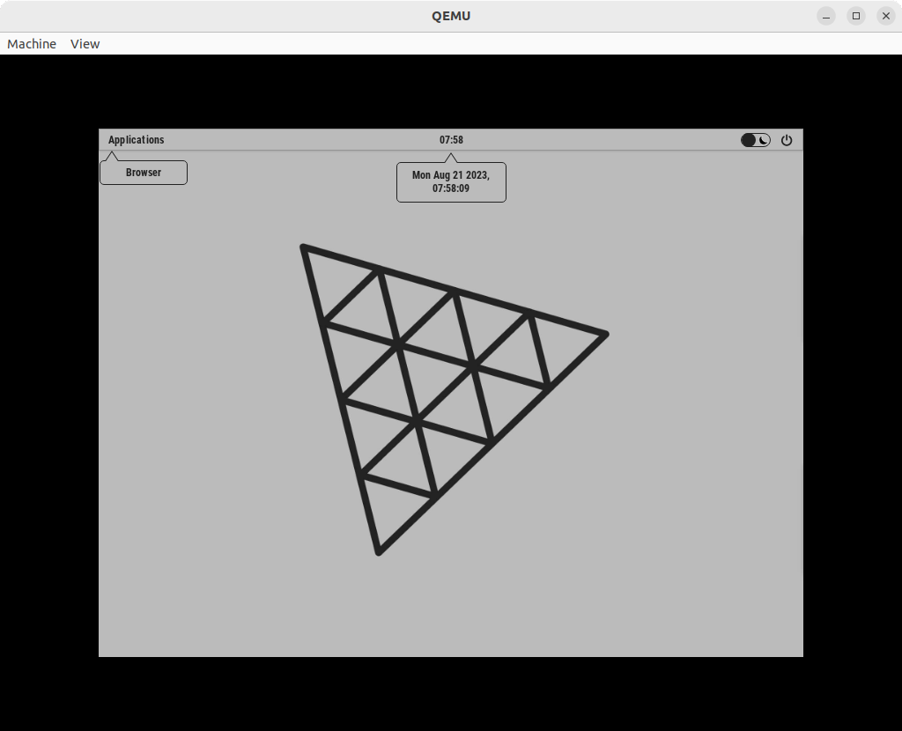
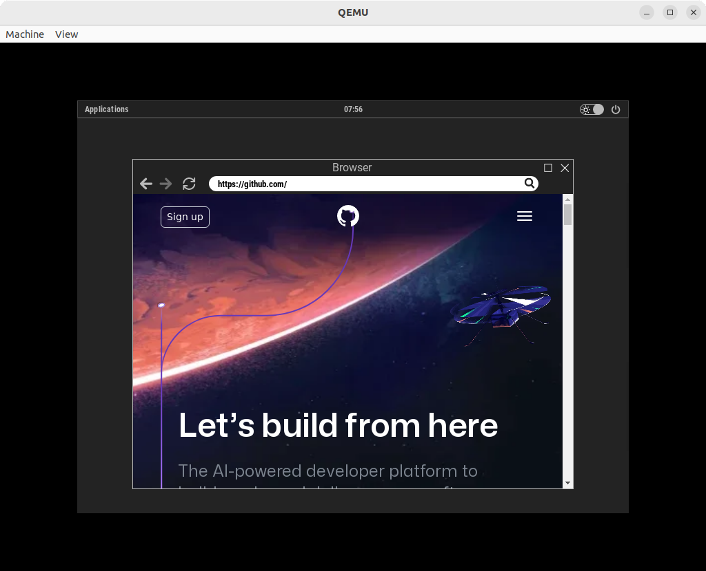

# BrowserOS #

_Electron app turned into OS_

> ⚠️ This project probably won't be maintained nor updated in any way. If you've found an issue or have a feature request, ~~please keep it to yourself.~~ don't be lazy and feel free to fork this repo and fix/implement it by yourself.





[![]](https://github.com/UstymUkhman/BrowserOS/assets/9247261/99711c62-1e3e-4d21-b934-e6bb1848514c)

## ❔ What Is This ##

Bare minimal JavaScript GUI for an x64 Linux OS. It uses [linux.js](https://github.com/MainSilent/linux.js), a debian based linux distro under the hood and an Electron app with TypeScript + SolidJS to interact and build a UI on top of it.

## 😕 But Why? ##

Because sometimes all you need is ~~love~~ a browser and... why not?

### ✨ Features ###

- Built with web technologies.

- No telemetry or other bloatware.

- Safe by default since everything is in a sandbox.

- Light and dark theme.

- Very minimal, Chromium based, web browser.

- Clock with date & time. But it's in JavaScript, so take it with a grain of salt.

### ❗ Limitations ###

- Built with web technologies.

- No filesystem. Could be probably implemented though.

- Does not work on Windows WSL2. Related [issue](https://github.com/MainSilent/linux.js/issues/2).

- Electron `v9.4.4` and (because of this) Chromium `v83.0.4103.122`. So no scoped CSS or others (relatively) new features. 😞 Related issues: [#20086](https://github.com/electron/electron/issues/20086#issuecomment-1649775507), [#17049](https://github.com/electron/electron/issues/17049) and [#19847](https://github.com/electron/electron/issues/19847).

## 💾 Download ##

```bash
$ git clone https://github.com/UstymUkhman/BrowserOS.git
$ cd BrowserOS/

$ pnpm i   # Install project dependencies
$ npx reqs # Download Linux filesystem
```

## ⌨️ Develop ##

```bash
$ pnpm start:web # As a web application
$ pnpm start:app # As an electron application
```

## ✔️ Lint ##

```bash
$ pnpm lint:js  # Run eslint for TS and JS
$ pnpm lint:css # Run stylelint for CSS
```

## 🧱 Build ##

```bash
$ pnpm build:web  # As a web application
$ pnpm build:app  # As an electron application
$ pnpm build:test # As an unpacked application
$ pnpm build:prod # As a production application
```

## 🚀 Run ##

### 💻 Qemu (Linux): ###

```bash
$ pnpm build:app  # Build as an electron application
$ pnpm build:prod # Package it to be production-ready

$ npx linuxjs     # Create an ISO image and launch qemu to run it:
$ qemu-system-x86_64 -boot d -cdrom filesystem/BrowserOS.iso -m 4096
```

### 👏 Credits ###

A special thank goes to [MainSilent](https://github.com/MainSilent) for [this](https://github.com/MainSilent/linux.js) awesome package.
